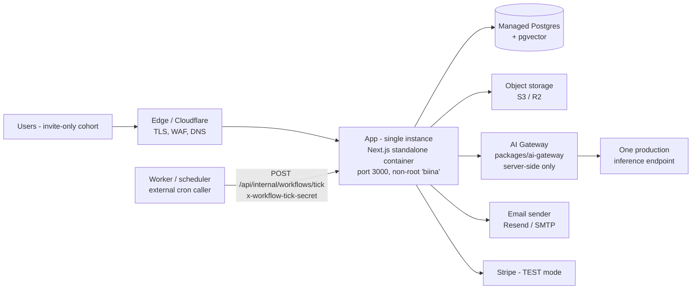

# Minimum Production Topology — BIINA.ai

The **smallest sane** production footprint for an **invite-only beta**. It runs the real
product honestly on a single app instance and scales up only when a
[scale trigger](#scale-triggers) fires. Nothing here requires Kubernetes or microservices.

Related: [`PRODUCTION_ARCHITECTURE.md`](./PRODUCTION_ARCHITECTURE.md) ·
[`PRODUCTION_INFRASTRUCTURE_CHECKLIST.md`](./PRODUCTION_INFRASTRUCTURE_CHECKLIST.md) ·
[`PRODUCTION_CUTOVER.md`](./PRODUCTION_CUTOVER.md) ·
[`GO_LIVE_RUNBOOK.md`](./GO_LIVE_RUNBOOK.md)

---

## Topology (beta)



Text fallback:

```
Users → Edge/Cloudflare → App (1 instance) → Postgres(+pgvector)
                                            → Object storage
                                            → AI Gateway → 1 inference endpoint
                                            → Email · Stripe (TEST)
External cron/worker → POST /api/internal/workflows/tick (shared secret) → App
```

---

## Box-by-box status

| Box | Status | Notes |
|---|---|---|
| **Edge / Cloudflare** | REQUIRES INFRASTRUCTURE | TLS termination, DNS, WAF/rate-limit at the edge. App emits a hardened CSP (see [`SECURITY.md`](./SECURITY.md)). |
| **App (single instance)** | IMPLEMENTED | Ships as the repo `Dockerfile` (multi-stage, `output: 'standalone'`, non-root `biina`, entrypoint `node apps/web/server.js`, port `3000`). Health at `GET /api/health`. **A single instance is correct for beta** — see below. |
| **Managed Postgres (+pgvector)** | REQUIRES INFRASTRUCTURE | App/migrations/seed are IMPLEMENTED; the managed instance must be provisioned. `validate:production` rejects an unmanaged/dev DB. Migrations 0000–0015 via `npm run db:migrate -w apps/web`. |
| **Object storage (S3/R2)** | REQUIRES INFRASTRUCTURE | Local FS is the code default today and is **not durable**; durable object storage is a **prerequisite for Files/RAG**. The validator makes `local` a production BLOCKER. |
| **Worker / scheduler (external tick)** | REQUIRES INFRASTRUCTURE | Endpoint `POST /api/internal/workflows/tick` is IMPLEMENTED (shared-secret, constant-time auth, disabled `503` without a secret). The **external cron/worker that calls it** must be provisioned, or scheduled workflows **silently never run**. See [`SCHEDULER.md`](./SCHEDULER.md). |
| **AI Gateway** | IMPLEMENTED | `packages/ai-gateway`, server-side only; providers = `mock` / `ollama` / `openai-compatible`. Frontend never learns which model answered. |
| **One production inference endpoint** | REQUIRES INFRASTRUCTURE | **No real production endpoint is configured yet.** `mock` is refused in production by code. A live endpoint is a launch BLOCKER (see [`GO_LIVE_RUNBOOK.md`](./GO_LIVE_RUNBOOK.md) step 11). |
| **Email sender** | REQUIRES INFRASTRUCTURE | Code default is `mock`/console. A real sender (`RESEND_API_KEY` or `SMTP_URL`) is needed for verification/reset/invite mail. |
| **Stripe (TEST)** | IMPLEMENTED (TEST) | `BILLING_LIVE_MODE=false` until live billing is approved. Webhooks are signature-verified + idempotent. See [`BILLING_RUNBOOK.md`](./BILLING_RUNBOOK.md). |

---

## Why single-instance is correct for beta

Two subsystems are **single-instance assumptions** by design today, and a single app
instance keeps them **valid**:

- **Rate limiting is process-local** (in-memory). With one instance, limits are global and
  accurate. Multiple instances would each count independently.
- **The scheduler is DB-authoritative** but advanced by an external tick. A single caller
  is enough for beta volume.

So the minimum footprint is deliberately **one app instance + one external tick caller**.
Do **not** add app replicas until you have moved rate limiting to a shared store — doing so
silently weakens rate limits.

---

## Not needed at first

- **No Kubernetes / service mesh / microservices.** One container behind the edge.
- **No separate worker fleet.** One cron caller for the tick suffices for beta.
- **No dedicated vector DB.** The portable `jsonb` vector store is rebuildable from source
  documents; `pgvector` is reserved for scale.
- **No read replicas / poolers** until DB pressure appears.

---

## Scale triggers

Move off this footprint when a trigger fires. Thresholds are **provisional** — confirm
against real load with [`LOAD_TESTING.md`](./LOAD_TESTING.md). Full table in
[`PRODUCTION_INFRASTRUCTURE_CHECKLIST.md`](./PRODUCTION_INFRASTRUCTURE_CHECKLIST.md#scale-triggers-provisional-thresholds):

| Signal | Provisional trigger | Action |
|---|---|---|
| **Rate-limit accuracy** | You need **> 1 app instance** | Move rate limiting to a shared store (e.g. Redis) **first**, then add instances |
| **Queue backlog** | Workflow/agent runs waiting past due; tick lag grows | Move the worker out-of-process; add worker replicas |
| **AI concurrency** | TTFT rising, provider 429/503, near endpoint limit | Add inference capacity/replicas; tune per-plan concurrency caps |
| **DB connection pressure** | Pool utilization sustained > ~70–80% | Add a pooler (PgBouncer), raise instance size, read replicas |
| **Vector latency** | RAG/memory retrieval dominates response time | Migrate portable vector store → `pgvector` |
| **Storage size** | Storage nearing limits; backup windows lengthening | Grow tier; lifecycle-archive old media |

> **Retire-at-scale reminder:** the in-process rate limiter and the single external tick
> are correct **only** while there is effectively one app instance. Horizontal scaling
> requires a shared rate-limit store and an external scheduler/worker **first**.
